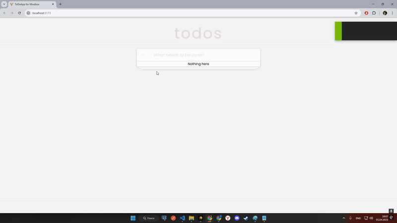

# Приложение To Do App 
- Выполнил tg: @AlexEquinox
- GitHub Pages: https://aequ1n0x.github.io/ToDoAppForMB/

Порядок запуска:
- Установить зависимости (npm i)
- Запустить приложение (npm run start)
- Запустить тесты (npm test)

Использованные технологии:
- ReactTS, Styled components
- Библиотека иконок Heroicons(иконки), uuid(для создания уникальных id локальных задач).

Приложение позволяет:
- Создавать дела
- Помечать задачу выполненной/невыполненной
- Сортировка по выполненности

